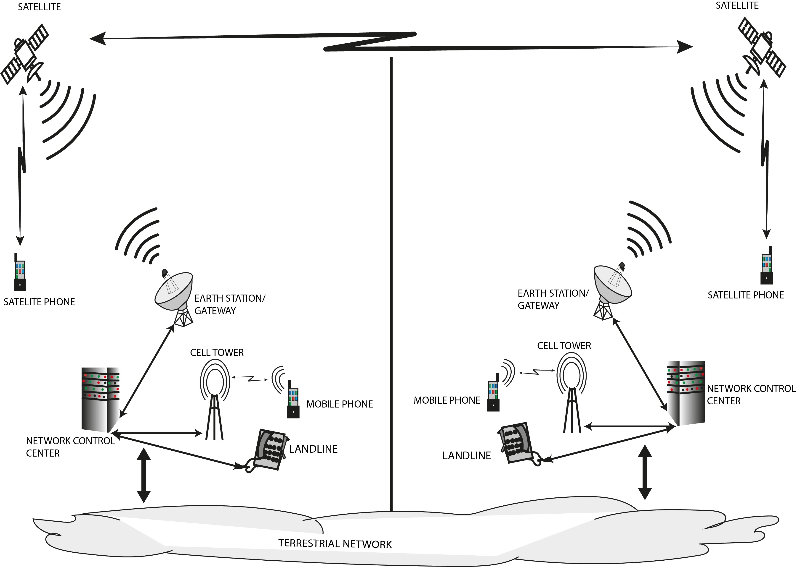
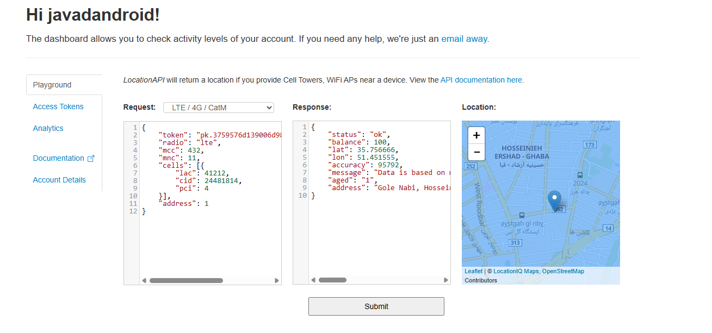

# $${\color{#FF5656}\textsf{Cell Towers Locating}}$$



***Cellular Positioning*** Have 3 Methods that is a sub for ***Network-Based Positioning***
>1- **Cell ID (Coarse)** easiest way to find location that return cell tower location\
>2- **RSSI (Received Signal Strength Indicator)** Distance estimation based on ***signal strength***. The weaker the signal, the further the distance. (Moderate accuracy)\
>3- **TDOA / ToF (Time Difference of Arrival / Time of Flight)** Precise calculation of signal round-trip time between the phone and multiple towers for triangulation. (High accuracy and complex mathematics)

---

<br/><br/>
# ${\color{#FFA239}\textsf{Sending Data in different Generations}}$
# ${\color{#FEEE91}\textsf{1. Generation 2 (GSM) Positioning Mechanics(BTS)}}$

## ${\color{#8CE4FF}\textsf{Communication Mechanism (TDMA)}}$

In GSM, synchronization is key to preventing signal collision in time slots.

* **Downlink (Tower -> Phone):** The BTS sends synchronization signals and the **Timing Advance (TA)** command.
* **Uplink (Phone -> Tower):** The Mobile Station (MS) sends an **Access Burst**. The tower measures the arrival time delay to calculate the distance.

## ${\color{#8CE4FF}\textsf{Key Positioning Parameters}}$
1.  **CGI (Cell Global Identity):** Unique identifier for the serving cell (MCC-MNC-LAC-CID).
2.  **TA (Timing Advance):** The primary distance estimator.
    * *Range:* 0 to 63.
    * *Accuracy:* ~550 meters per unit (Low precision).
3.  **RXLEV (Received Signal Level):** Signal strength (measured in dBm) used for rough proximity estimation.
4.  **BSIC (Base Station Identity Code):** Distinguishes between neighboring cells using the same frequency.

<br/><br/>

# ${\color{#FEEE91}\textsf{2. Generation 3 (UMTS/WCDMA) Positioning Mechanics(NodeB)}}$

## ${\color{#8CE4FF}\textsf{Communication Mechanism (CDMA)}}$
In 3G, all towers transmit on the same frequency simultaneously using unique codes.

* **The Challenge (Hearability):** Strong signals from the serving cell can drown out neighbor cells needed for triangulation (Near-Far problem).
* **Downlink (Tower -> Phone):** The network uses **IPDL (Idle Period Downlink)**. The serving NodeB briefly ceases transmission, creating a "silence period" that allows the User Equipment (UE) to detect weaker signals from neighbor cells via the **CPICH** (Common Pilot Channel).
* **Uplink (Phone -> Tower):** The UE measures the timing differences of these pilot signals and reports back to the network.

## ${\color{#8CE4FF}\textsf{Key Positioning Parameters}}$
1.  **PSC (Primary Scrambling Code):** The unique identifier for the NodeB (tower) in the CDMA network.
2.  **RSCP (Received Signal Code Power):** The power of the specific pilot signal (CPICH) from a tower. This is the primary metric for path loss and distance estimation.
3.  **Ec/No (Energy per chip over Noise):** Represents the signal quality/interference ratio. Low Ec/No means high interference.
4.  **RTT (Round Trip Time):** Measures the time taken for a signal to travel to the tower and back, used for precise distance calculation (Successor to TA).

<br/><br/>

# ${\color{#FEEE91}\textsf{3. Generation 4 (LTE) Positioning Mechanics(eNodeB)}}$


## ${\color{#8CE4FF}\textsf{Communication Mechanism (OFDMA and PRS)}}$
LTE utilizes an **OFDMA** structure, treating the frequency spectrum as a time-frequency grid.

* **Downlink (Tower -> Phone):** The network transmits dedicated **PRS (Positioning Reference Signals)**. These signals are staggered in the time-frequency grid so that PRS from neighboring cells do not interfere with each other, allowing the UE to detect multiple towers clearly.
* **Uplink/Measurement:** The UE measures the **RSTD (Reference Signal Time Difference)** between the serving cell and neighbor cells and reports it for calculation (OTDOA method).

## ${\color{#8CE4FF}\textsf{Key Positioning Parameters}}$
1.  **PCI (Physical Cell ID):** The unique physical identifier for the cell (Range: 0-503).
2.  **RSRP (Reference Signal Received Power):** The linear average power of the reference signals. This is the **standard metric** for coverage and distance estimation in LTE, offering superior stability over legacy RSSI.
3.  **RSRQ (Reference Signal Received Quality):** Indicates the quality of the received signal, helpful for assessing interference.
4.  **TA (Timing Advance):** Highly refined distance measurement.
    * *Range:* 0 to 1282.
    * *Accuracy:* ~78 meters per unit (High precision).


<br/><br/>

# ${\color{#FEEE91}\textsf{4. Generation 5 (5G NR) Positioning Mechanics(gNodeB)}}$

## ${\color{#8CE4FF}\textsf{Communication Mechanism (Beamforming \\& Sweeping)}}$

5G introduces a paradigm shift from omnidirectional broadcasting to directional **Beamforming**.

* **Downlink (Beam Sweeping):** The gNodeB (tower) transmits Synchronization Signal Blocks (SSB) in sequential beams covering different angular sectors (Beam Sweeping).
* **Uplink/Measurement:** The UE identifies the strongest beam (Best Beam) and reports its index (Beam ID) and signal quality back to the network. This provides the network with the user's **angular direction** relative to the tower.

## ${\color{#8CE4FF}\textsf{Key Positioning Parameters}}$
1.  **Beam ID (SSB Index):** Identifies the specific spatial beam covering the user. This is the primary proxy for **Direction/Angle**.
2.  **SS-RSRP (Synchronization Signal RSRP):** The received power of the specific SSB beam (linear average).
3.  **AoA / AoD (Angle of Arrival / Departure):** Critical for geometric triangulation.
    * *AoA:* The angle at which the UE signal hits the tower antenna array.
    * *AoD:* The angle at which the tower transmits towards the UE.
4.  **PCI (Physical Cell ID):** Expanded range (0-1007) compared to LTE.

<br/><br/>

# ${\color{#FEEE91}\textsf{Locating Towers}}$

Telecommunication towers (BTS/NodeB/eNodeB/gNodeB) continuously broadcast data packages known as **"System Information Blocks" (SIB)** into the air. A user's device can "hear" and decode these signals even without an active SIM card.

This information includes three categories vital for positioning:

## ${\color{#8CE4FF}\textsf{A) Identity Parameters}}$
These act as the "postal address" of the tower. Combining these numbers creates a **Cell Global Identity (CGI)**:

* **MCC (Mobile Country Code):** Country code (e.g., 432 for Iran).
* **MNC (Mobile Network Code):** Operator code (e.g., 11 for MCI, 35 for Irancell).
* **LAC/TAC (Location/Tracking Area Code):** Area code (similar to a neighborhood zip code).
* **CID/ECI (Cell Identity):** The unique ID (specific plate number) of that specific antenna.

## ${\color{#8CE4FF}\textsf{B) Signal Strength}}$
The phone measures how "loud" or "quiet" the tower sounds.

* **RSSI (2G/3G):** Total Received Signal Strength Indicator.
* **RSRP (4G/5G):** Reference Signal Received Power. This is more precise and stable than RSSI, measuring only the reference signal power.

## ${\color{#8CE4FF}\textsf{C) Timing Parameters}}$
* **TA (Timing Advance):** A value sent by the tower to the phone to compensate for transmission delay (directly related to distance).
* **ToA (Time of Arrival):** The exact arrival time of the signal (highly precise in 4G and 5G networks).

# ${\color{#FEEE91}\textsf{Where to Find Tower Coordinates? (Data Sources)}}$

Since cell towers do not broadcast their own geographic coordinates (Latitude/Longitude), we must rely on external databases to map a Cell ID to a physical location.

## ${\color{#8CE4FF}\textsf{A) Open Source Databases 🌐}}$
These databases are crowdsourced by users. You can download the entire dataset for free.
* **OpenCellID:** The world's largest open community database of cell towers.
    * *Pros:* Free, extensive coverage for 2G, 3G, and 4G (LTE).
    * *Cons:* **Weak 5G coverage.** Since 5G requires specialized hardware/software to log accurate Beam IDs, user contributions are scarce.
* **Mozilla Location Service (MLS):**
    * *Status:* **Retired (2024).** While it was a major source, it is no longer accepting new data, making it unsuitable for future-proof applications.

## ${\color{#8CE4FF}\textsf{B) Commercial APIs 💼}}$
Tech giants collect massive amounts of data from Android/iOS devices to build highly accurate, proprietary maps.
* **Google Geolocation API / Unwired Labs:**
    * *Pros:* Extremely accurate, supports 5G, and updates in real-time.
    * *Cons:* Paid services (usually with a limited free tier). Best for commercial or high-precision needs.

    Example of unwiredlabs:
    

## ${\color{#8CE4FF}\textsf{C) "War Driving" (Manual Collection) 🚗}}$
For specific, local projects (e.g., a university campus or industrial site), you can build your own database.
* *Method:* Drive or walk through the target area with a customized app that logs the **Cell ID** and your phone's **GPS coordinates** simultaneously.
* *Use Case:* Essential when working with private networks or areas where open data is missing.

### 💡 Strategy for 5G Positioning
Due to the lack of open 5G data, a common workaround is **"4G Fallback"**. Since most current 5G networks (NSA) rely on a 4G anchor, you can use the coordinate of the associated 4G tower to estimate the user's general location.

<br/><br/>

# ${\color{#FEEE91}\textsf{Positioning Algorithms (Processing)}}$

Once the device gathers data from nearby towers, specific algorithms are used to estimate the user's coordinates $(x, y)$.


## ${\color{#8CE4FF}\textsf{A) Proximity (Cell-ID Method) 📍}}$
The simplest approach. It assumes the user is located at the exact coordinates of the serving cell tower.
* **Algorithm:** Query the database with the `Cell ID` -> Return Tower Lat/Long.
* **Accuracy:** Low. Defined by the cell's coverage radius (500m - several km).

## ${\color{#8CE4FF}\textsf{B) Trilateration (RSSI/RSRP Based) 📐}}$
Uses signal strength to estimate distance from at least three towers.
* **Concept:** Intersection of three circles.
* **Formula (Path Loss Model):** Converts signal strength to distance ($d$).
    $$d = d_0 \cdot 10^{\frac{TX - RSRP}{10n}}$$
    * $TX$: Tower transmission power.
    * $n$: Path loss exponent (depends on environment, e.g., Urban = 3.5).
* **Challenge:** Signal reflection (Multipath) can cause huge errors in distance estimation.

## ${\color{#8CE4FF}\textsf{C) Multilateration (TDoA) ⏰}}$
Uses the *Time Difference of Arrival* of signals from multiple synchronized towers.
* **Concept:** Intersection of hyperbolas.
* **Mechanism:** If a signal from Tower A arrives $1\mu s$ before Tower B, the user is located on a specific hyperbolic curve relative to them.
* **Accuracy:** High, but requires precise nanosecond-level synchronization between towers.

## ${\color{#8CE4FF}\textsf{D) The High-Rise Challenge (3D Positioning Error) 🏢}}$

**Scenario:** When the user is in a skyscraper or high-rise building.
**The Problem:** Standard algorithms assume a 2D plane ($z_{user} \approx z_{tower}$). High altitude causes two major errors:
1.  **Slant Range Error:** The measured distance is the hypotenuse, not the ground distance.
2.  **Overshooting:** The device connects to a distant tower (LoS) instead of the nearest one (which is downtilted towards the street), causing massive location jumps (e.g., >500m).

**Algorithmic Fix (Heuristic):**
If available, use the device's **Barometer** sensor to detect altitude changes relative to ground pressure.

* **Formula Adjustment:**
    Apply a heavier **Path Loss Exponent ($n$)** for high altitudes. Signals at height usually travel through free space (LoS) rather than urban clutter, so standard urban models ($n=3.5$) fail.
    * *Street Level:* $n \approx 3.5 - 4.0$
    * *High-Rise (LoS):* $n \approx 2.0 - 2.5$

* **Logic Check:** If `Altitude` is high AND `RSRP` is strong but `TA` (Timing Advance) indicates a large distance, flag the location as "Low Confidence - High Rise Overshoot".

# ${\color{#FEEE91}\textsf{Challenges, Algorithms, \& Implementation 📡)}}$


This document outlines the technical hurdles of retrieving geolocation without GPS using Cellular Network data (LTE/GSM) and provides algorithmic solutions for various scenarios, from data collection to final positioning.

---

## 1. Technical Challenges & Data Artifacts 🚧

When working with Android's `getAllCellInfo()` and raw modem data, developers must first sanitize the data to avoid positioning errors.

### A. The "Ghost Cell" Phenomenon 👻
Modems prioritize battery life. They monitor the **Physical Layer** of neighbor cells to measure signal strength but often skip decoding the **Data Layer** (Identity).
* **Result:** You receive `PCI` (Physical Cell ID) and `RSRP` (Signal Strength), but `MCC`, `MNC`, and `CID` are missing or invalid.

### B. Data Artifacts (Sentinel Values) 🐞
When the modem fails to read a value, it returns specific "Max Values" instead of `null`. These must be filtered out before processing.

| Parameter | Invalid Value | Reason | Action |
| :--- | :--- | :--- | :--- |
| **MCC/MNC** | `2147483647` | `Integer.MAX_VALUE` (32-bit) | Identity not decoded. Filter out. |
| **TAC** | `65535` | 16-bit Overflow (`0xFFFF`) | Area Code unknown. Filter out. |
| **CI** | `268435455` | 28-bit Max Value | Cell Identity unknown. Filter out. |

---

## 2. Step 1: Data Cleaning Strategy 🧹

Before running any algorithm, implement a strict filter loop to keep only "Valid" towers.

**Filtering Rules:**
1.  **Identity Check:** `MCC`, `MNC`, and `CI` must **NOT** be `2147483647`.
2.  **Range Check:** `TAC` must be `< 65535`.
3.  **Signal Check:** `RSRP` must be valid (negative values, typically -40 to -140 dBm).

---

## 3. Scenario A: Single-Tower (Single-SIM) 🎯

**Condition:** Only 1 valid tower is visible (e.g., Single-SIM device, no resolved neighbors).
**Problem:** The "Donut Problem." We can calculate the radius (distance), but we lack the exact angle.

### Step 1: Calculate Distance (Radius)
We estimate distance ($d$) to define the radius of accuracy.

* **Method 1: Timing Advance (TA) - *Most Accurate***
    LTE networks measure round-trip signal time.
    $$d \approx TA \times 78 \text{ meters}$$
* **Method 2: Path Loss (Signal Strength) - *Fallback***
    $$d = 10^{\frac{TX - RSRP}{10 \times n}}$$
    *(Where $TX \approx 45dBm$ and $n \approx 3.5$ for urban areas)*.

### Step 2: Estimate Direction (Sectorization) 🍕

If no database with antenna angles is available, we can use a common heuristic based on the **Cell ID (CI)**. Cell towers are typically divided into 3 sectors (120° each). The **last digit** of the CI often indicates the antenna's direction.

| Last Digit of CI | Estimated Direction | Azimuth Range |
| :--- | :--- | :--- |
| **1** | North / North-East | $0^\circ - 120^\circ$ |
| **2** | South-East | $120^\circ - 240^\circ$ |
| **3** | West | $240^\circ - 360^\circ$ |

> **Note:** This is a common convention in network planning but not a guaranteed standard for every operator.

**Example:**
* **Cell ID:** `4382649`**`2`**
* **Interpretation:** The user is likely in the **South-East** slice of the tower's coverage.

---

## 4. Scenario B: Two Towers (Dual-SIM / 1 Neighbor) ⚖️

**Condition:** We have 2 distinct anchors (e.g., Dual SIM).
**Algorithm:** Weighted Centroid.
**Logic:** The user is positioned on the line connecting the towers, pulled closer to the one with the stronger signal.

### The Formula
$$Lat_{user} = \frac{\sum (Lat_i \times w_i)}{\sum w_i} , \quad Lon_{user} = \frac{\sum (Lon_i \times w_i)}{\sum w_i}$$

**Weight Calculation ($w_i$):**
We use the inverse of the signal strength. Stronger signal (closer to 0) = Higher weight.
$$w_i = \frac{1}{|RSRP_i|}$$

---

## 5. Scenario C: Three+ Towers (Ideal) 📐

**Condition:** 3 or more resolved anchors.
**Algorithm:** Trilateration (Intersection of Circles).
**Logic:** The user is located exactly where the three circles intersect.


[Image of trilateration with 3 intersecting circles]


### The Mathematical Model
We solve the linear system derived from circle equations:
$$A \cdot x + B \cdot y = C$$
$$D \cdot x + E \cdot y = F$$

Where $A, B, D, E$ are coefficients derived from tower coordinates, and $C, F$ derived from radii and coordinates. Solving this system yields the exact $(x, y)$.

---

## 6. War Driving: Building Your Own Database 🚗

Since public databases often lack 5G data or precise Azimuth angles, collecting your own data is crucial for high-precision projects.

**The "Golden Data List" to Log:**
Ensure you record these parameters for every scan line in your CSV/Database:

1.  **Timestamp:** To analyze signal stability over time.
2.  **GPS Lat/Lon:** Your ground truth (Reference Location).
3.  **GPS Accuracy:** *Critical.* Discard any log where GPS accuracy > 20m.
4.  **Cell Identifiers:** `MCC`, `MNC`, `CI`, `LAC/TAC`.
5.  **PCI (Physical Cell ID):** Vital for mapping neighbor cells later (resolving Ghost Cells).
6.  **RSRP (Signal Strength):** To determine the "center" of the cell and calculate path loss.
7.  **EARFCN:** Frequency band info (helps in estimating propagation characteristics).

---

## 7. Comprehensive Python Implementation 🐍

This script combines all logic: Sector estimation, Distance calculation, Weighted Centroid, and Trilateration.

```python
import math

class CellTower:
    def __init__(self, name, lat, lon, rsrp, cell_id=None, ta=None):
        self.name = name
        self.lat = lat
        self.lon = lon
        self.rsrp = rsrp
        self.cell_id = cell_id
        self.ta = ta
        # Calculate approximate radius (Fallback model)
        self.radius_km = math.pow(10, (45 - rsrp) / 35.0) / 1000.0

# --- 1. Helper: Estimate Sector Direction ---
def get_sector_direction(cell_id):
    if not cell_id: return "Unknown"
    
    # Extract the last digit
    last_digit = int(str(cell_id)[-1])
    
    if last_digit == 1:
        return "North/NE (0-120 deg)"
    elif last_digit == 2:
        return "South-East (120-240 deg)"
    elif last_digit == 3:
        return "West (240-360 deg)"
    else:
        return "Omnidirectional/Unknown"

# --- 2. Algorithm: Weighted Centroid (2 Towers) ---
def calculate_weighted_centroid(towers):
    sum_lat = 0
    sum_lon = 0
    sum_weight = 0
    
    for t in towers:
        # Simple inverse weight: Stronger signal (smaller abs) -> Higher weight
        weight = 1.0 / abs(t.rsrp)
        sum_lat += t.lat * weight
        sum_lon += t.lon * weight
        sum_weight += weight
        
    return sum_lat / sum_weight, sum_lon / sum_weight

# --- 3. Algorithm: Trilateration (3 Towers) ---
def trilaterate(t1, t2, t3):
    # Simplified linear algebra solver for circle intersection
    x1, y1, r1 = t1.lat, t1.lon, t1.radius_km
    x2, y2, r2 = t2.lat, t2.lon, t2.radius_km
    x3, y3, r3 = t3.lat, t3.lon, t3.radius_km

    # Linearization coefficients
    A = 2*x2 - 2*x1
    B = 2*y2 - 2*y1
    C = r1**2 - r2**2 - x1**2 + x2**2 - y1**2 + y2**2
    D = 2*x3 - 2*x2
    E = 2*y3 - 2*y2
    F = r2**2 - r3**2 - x2**2 + x3**2 - y2**2 + y3**2

    det = (B*D) - (E*A)
    if det == 0: return None # Collinear error (towers in a straight line)

    final_lat = ((C*E) - (F*B)) / ((E*A) - (B*D))
    final_lon = ((C*D) - (F*A)) / ((B*D) - (A*E))
    return final_lat, final_lon

# ================= EXAMPLES =================

# Example A: Single Tower with Sector Logic
# CI ends in 2 -> Likely SE direction
tower_single = CellTower("Single_Node", 35.70, 51.40, -80, cell_id=43826492, ta=10)
dist = tower_single.ta * 78
sector = get_sector_direction(tower_single.cell_id)

print(f"--- Scenario A: Single Tower ---")
print(f"Distance: {dist} meters")
print(f"Direction: {sector}")
print(f"Result: User is {dist}m away from tower, likely in the South-East sector.\n")

# Example B: Multi-Tower Logic
t1 = CellTower("Anchor_1", 35.700, 51.400, -70)
t2 = CellTower("Anchor_2", 35.710, 51.410, -90)
t3 = CellTower("Anchor_3", 35.705, 51.390, -75)

# Try Trilateration (Best accuracy)
trilat_result = trilaterate(t1, t2, t3)
print(f"--- Scenario C: Trilateration (3 Towers) ---")
print(f"Exact Loc: {trilat_result}")

# Try Weighted Centroid (Fallback accuracy)
centroid_result = calculate_weighted_centroid([t1, t2])
print(f"\n--- Scenario B: Weighted Centroid (2 Towers) ---")
print(f"Approx Loc: {centroid_result}")
```


## 5. Step 1: Data Cleaning & Filtering 🧹

Before feeding the raw data into any positioning algorithm, we must filter out "Garbage Data". In Android, the modem often returns invalid or cached objects alongside real measurements.

### The "Ghost Cell" Problem 👻
We observed that many entries in the `allCellInfo` list contain invalid values. Using these will break the algorithm.

**Signs of Invalid Data:**
1.  **The Magic Number (`2147483647`):** This equals `Integer.MAX_VALUE`. In Android SDK, this value signifies "Unknown" or "Unreported" data. If `MCC`, `MNC`, or `CI` equals this number, the cell is unusable.
2.  **Duplicate IDs:** Sometimes, the modem repeats the `CI` and `TAC` of the serving cell for neighbor cells that haven't been fully decoded yet.
3.  **Incomplete Identity:** A cell with valid signal strength (`dBm`) but invalid identity (`MNC`/`CID`) cannot be looked up in any database.

### Implementation Logic ⚙️
We need a strict filter loop to keep only "Valid" towers.

**Filtering Rules:**
* `MCC` AND `MNC` must NOT be `2147483647`.
* `CI` (Cell Identity) must NOT be `2147483647`.
* `Type` must be a supported technology (e.g., `CellInfoLte`, `CellInfoGsm`, `CellInfoWcdma`, `CellInfoNr`).

**Pseudo-Code:**
```kotlin
val validCells = ArrayList<CellInfo>()

for (cell in allCellInfo) {
    // Check for "The Magic Number"
    if (cell.cellIdentity.mcc == Int.MAX_VALUE || 
        cell.cellIdentity.mnc == Int.MAX_VALUE || 
        cell.cellIdentity.ci  == Int.MAX_VALUE) {
        continue // Skip this ghost cell 🗑️
    }

    // Optional: Filter by specific carrier if needed
    // if (cell.cellIdentity.mnc != TARGET_MNC) continue

    validCells.add(cell) // Keep this valid cell ✅
}
```

---

# Network-Based Positioning Challenges

## 1. The "Ghost Cell" Phenomenon (Neighbor Cells)
When retrieving cell tower information using `getAllCellInfo()` in Android, neighbor cells often appear with incomplete data.

* **Symptom:** The Serving Cell provides full identity (MCC, MNC, CI, TAC), but Neighbor Cells often report `Integer.MAX_VALUE` for these fields.
* **Cause:** The mobile modem optimizes battery usage by monitoring only the **Physical Layer** of neighbor cells (to measure signal strength) without decoding the **Data Layer** (which contains the Cell Identity).
* **Result:** You receive the signal strength (`RSRP`) and Physical Cell ID (`PCI`), but not the unique Global Cell ID (`CID`). This makes standard triangulation difficult without a reference database.

## 2. Lack of Directional Data (Azimuth)
Standard Android APIs provide the location of the device, but not the directional information of the connected tower.

* **The Sector Concept:** A single physical tower structure usually supports multiple antennas (sectors), typically three, each covering a 120-degree slice.
* **The Problem:** Public databases often store the tower's location as a single point. Without knowing the **Azimuth** (the direction the antenna is facing) and the specific Sector ID, the positioning logic assumes an omnidirectional signal (a circle), whereas the reality is a directional cone (a sector).
* **Impact:** This reduces positioning accuracy, as the user is likely in a specific slice of the coverage area, not anywhere within the radius.

## 3. System Limitations
* **No Force-Decode:** Standard Android SDKs do not allow developers to force the modem to fully decode neighbor cells.
* **Data Overflow:** Some 16-bit fields (like TAC) may show overflow values (`65535`) if the network configuration exceeds standard limits or is read incorrectly by the API.


## 6. Advanced Challenges & Solutions 🛠️

### A) The "Ghost Cell" Phenomenon (Neighbor Cells without Identity) 👻
**Observation:** You might see neighbor cells (marked as `N`) in the raw data with signal strength (`dBm`) but invalid IDs (`MCC`, `MNC`, `CID` are empty or `Integer.MAX_VALUE`).
**Cause:** The modem monitors the *Physical Layer* of neighbors for handover readiness but saves battery by NOT decoding their full *Data Layer* (Identity) until necessary.
**Solution Strategy:**
1.  **Primary Strategy (Anchor):** Ignore them. Rely solely on the Serving Cell (which always has a full ID) for the location fix.
2.  **Advanced Strategy (PCI Matching):** If your database is extremely detailed, use the **PCI (Physical Cell ID)**—which IS available for neighbors—to identify them.
    * *Logic:* "Find the tower that has PCI `287` and is located within 5km of my Serving Cell."

### B) Sectorization & Azimuth (Directional Signal) 🍕
**Concept:** Cell towers are not omnidirectional lightbulbs. They usually divide coverage into 3 sectors (120° each).
**Implication:** Each sector has a unique **Cell ID (CI)**.
* *Example:* If Tower A has 3 antennas, you might see `CI: 101` (North), `CI: 102` (SE), `CI: 103` (SW).
* **Positioning Benefit:** Knowing the `CI` gives us not just a circle, but a **"Pizza Slice" (Sector)** area, significantly improving accuracy.

### C) War Driving: Building Your Own Database 🚗
Since public databases often lack 5G data or precise Azimuth angles, collecting your own data is crucial for high-precision projects.

**The "Golden Data List" to Log:**
Ensure you record these parameters for every scan:
1.  **Timestamp:** To analyze signal stability over time.
2.  **GPS Lat/Lon:** Your ground truth (Reference Location).
3.  **GPS Accuracy:** *Critical.* Discard any log where GPS accuracy > 20m.
4.  **Cell Identifiers:** `MCC`, `MNC`, `CI`, `LAC/TAC`.
5.  **PCI (Physical Cell ID):** Vital for mapping neighbor cells.
6.  **RSRP (Signal Strength):** To determine the "center" of the cell and calculate path loss.
7.  **EARFCN:** Frequency band info (helps in estimating propagation characteristics).


## Calibration, REF_LOSS and Geometry Helpers (Implementation notes)

This project includes several practical helpers for calibration and geometric computations used by the API and the backend positioning logic. The purpose of this section is to explain the implemented formulas, the assumptions behind them, and how to use the provided endpoints and helpers.

### 1) Calibration (compute effective path-loss exponent `n`)

Purpose: derive an environment-specific path-loss exponent `n_effective` from a single ground-truth sample so that RSS-based distance estimates become more realistic for the local environment.

Inputs:
- `tower_lat`, `tower_lon`: tower coordinates (WGS84 degrees)
- `user_lat`, `user_lon`: ground-truth user coordinates
- `rsrp`: measured RSRP in dBm at the user
- optional `tx` (tower transmit power dBm) and `ref_loss` (reference loss at 1m, dB)

Method:
1. Compute the great-circle distance `d` (meters) between the tower and the user using Haversine.
2. Use the path-loss inversion formula:

The inversion used by the calibration endpoint is written here in mathematical form:

$$
n_{\mathrm{effective}} = \frac{(TX - RSRP) - REF\_LOSS}{10\,\log_{10}(d)}
$$

where:
- $TX$ is the transmit power in dBm (provided or default),
- $RSRP$ is the measured receive power in dBm at the user, and
- $REF\_LOSS$ is the reference path loss at 1 m in dB (provided or estimated).

where `TX` and `REF_LOSS` are supplied or fall back to defaults (e.g. TX ≈ 40 dBm, REF_LOSS ≈ 80 dB). The result `n_effective` should be validated and, if needed, clamped to reasonable bounds (e.g. 1.5–6.0) before saving.

Endpoint: `POST /api/calibrate/` accepts the fields above and returns `{ "n_effective": <float>, "details": {...} }`.

### 2) REF_LOSS estimator (reference path loss at 1 m)

Purpose: produce a reasonable `REF_LOSS` (dB) value when the per-site constant is unknown. This value represents the expected free-space loss (plus small system losses) at a reference distance of 1 meter and is used as the additive constant in the path-loss model.

Approach implemented:
- Convert `earfcn` (if provided) to downlink frequency in MHz using a small band table for common LTE bands. If the caller already provides `freq_mhz`, that value is used directly.
- Compute FSPL at 1 m (MHz units):

The estimator follows the free-space path-loss (FSPL) expression in dB (specialized to 1 meter):

$$
\mathrm{FSPL}_{1\mathrm{m}} = 20\,\log_{10}(f_{\mathrm{MHz}}) + 32.44
$$

The project then adjusts FSPL by antenna gains and system losses to produce the reference loss constant:

$$
\mathrm{REF\_LOSS} = \mathrm{FSPL}_{1\mathrm{m}} - G_t - G_r + L_{\mathrm{sys}}
$$

where $G_t$ and $G_r$ are transmitter and receiver antenna gains (dBi), and $L_{\mathrm{sys}}$ is the combined system/cable loss (dB).

where `G_t` is transmitter antenna gain (dBi), `G_r` is receiver antenna gain (dBi), and `L_sys` is estimated system/cable losses (dB).

Endpoint: `POST /api/ref_loss/` accepts JSON `{ "earfcn": <int> }` or `{ "freq_mhz": <float> }` plus optional `gt_dbi`, `gr_dbi`, `system_losses_db`. It returns `{ "freq_mhz": <float>, "ref_loss_db": <float>, "details": {...} }`.

Usage note: the estimator is a physics-based heuristic (FSPL) and should be used as a starting value. For best results, compute `REF_LOSS` from multiple ground-truth samples and/or apply the calibration endpoint to derive both `n` and a refined `REF_LOSS`.

### 3) Geometry helpers implemented

The file `cellular/utils/geometry.py` contains the following public helpers used by the API logic:

- `calculate_distance(rsrp, tx_power=None, n=None, ref_loss=None)`
    - Purpose: convert RSRP (dBm) into an approximate distance (meters) using the path-loss model. The implemented formula is:

$$
d = 10^{\frac{(TX - RSRP) - REF\_LOSS}{10\,n}}
$$
    - Behavior: uses project defaults from `settings.PATH_LOSS` when tower-specific values are missing; clamps results to a sensible range (e.g. 10 m — 50 km).

- `distance_from_ta(ta)`
    - Purpose: convert LTE Timing Advance (TA) into meters. The implementation uses the usual LTE approximation:

$$
d\approx TA \times 78\ \mathrm{m}
$$

    Returns `None` for invalid TA values.

- `earfcn_to_freq_mhz(earfcn)`
    - Purpose: convert common EARFCN (N_DL) values into DL frequency (MHz) using a small mapping for common bands (B1, B3, B7, B8, B20). If the supplied value already looks like MHz (e.g. 1800), it is returned as-is.

- `estimate_ref_loss_from_earfcn(earfcn or freq_mhz, gt_dbi=15.0, gr_dbi=0.0, system_losses_db=3.0)`
    - Purpose: compute `REF_LOSS` using FSPL@1m then adjust for antenna gains and system losses (see formulas above).

- `estimate_bearing(cell_id)`
    - Purpose: a pragmatic heuristic to estimate sector azimuth from the Cell ID when antenna azimuth is unknown. The implementation extracts lower bits of the cell id (sector) and maps a last-digit heuristic into an azimuth. This is not universal but gives useful directional priors for single-anchor fixes.

- `calculate_new_coordinates(lat, lon, distance_meters, bearing)`
    - Purpose: compute the destination point (lat, lon) given starting coordinates, a distance in meters and a bearing in degrees. Uses the great-circle (spherical) destination formula. Given start latitude $\phi_1$, longitude $\lambda_1$, bearing $\theta$ (radians) and angular distance $\delta = d/R$, the destination is:

$$
\phi_2 = \arcsin\big(\sin\phi_1\cos\delta + \cos\phi_1\sin\delta\cos\theta\big)
$$

$$
\lambda_2 = \lambda_1 + \operatorname{atan2}\big(\sin\theta\sin\delta\cos\phi_1,\;\cos\delta - \sin\phi_1\sin\phi_2\big)
$$

where $R$ is Earth radius and outputs are converted back to degrees.

- `weighted_centroid(towers)`
    - Purpose: compute a position by weighting tower coordinates by signal strength (stronger RSRP → larger weight). The implemented weighting and centroid are:

$$
w_i = \frac{1}{|RSRP_i| + \varepsilon}
$$

$$
\mathrm{Lat}_{\mathrm{user}} = \frac{\sum_i w_i\,\mathrm{Lat}_i}{\sum_i w_i},\quad
\mathrm{Lon}_{\mathrm{user}} = \frac{\sum_i w_i\,\mathrm{Lon}_i}{\sum_i w_i}
$$

where $\varepsilon$ is a tiny constant to avoid division by zero.

- `trilaterate_three(t1, t2, t3)`
    - Purpose: perform planar trilateration using three towers (each a dict with `lat`, `lon`, `radius` in meters). After projecting lat/lon into a local Cartesian plane (x, y), the linear system solved is:

$$
A x + B y = C
$$
$$
D x + E y = F
$$

with

$$
A = 2(x_2 - x_1),\quad B = 2(y_2 - y_1)
$$

$$
C = r_1^2 - r_2^2 - x_1^2 + x_2^2 - y_1^2 + y_2^2
$$

$$
D = 2(x_3 - x_2),\quad E = 2(y_3 - y_2)
$$

$$
F = r_2^2 - r_3^2 - x_2^2 + x_3^2 - y_2^2 + y_3^2
$$

The solution (if the determinant $AE - BD \neq 0$) is computed as:

$$
x = \frac{C E - B F}{A E - B D},\quad y = \frac{A F - C D}{A E - B D}
$$

Finally the planar result is converted back to latitude/longitude by inverse projection.

### Practical integration notes

- Single-anchor flow: prefer `distance_from_ta(ta)` when TA exists. Otherwise use `calculate_distance(rsrp)` and then `calculate_new_coordinates` with either a known `antenna_azimuth` or `estimate_bearing(cell_id)` to produce a sector-constrained point and radius.
- Two-anchor flow: use `weighted_centroid` over the two tower coordinates with RSRP-based weights.
- Three-or-more: pick top-3 signals and run `trilaterate_three`. If trilateration fails (collinear towers, numerical issues), fallback to the weighted centroid of all anchors.

### Recommendations

- Use the calibration endpoint to derive `n_effective` for your coverage area whenever you can collect ground-truth samples. This single parameter dramatically reduces systematic bias in RSS-based distance estimates.
- Combine physics-based estimators (REF_LOSS from FSPL) with empirical calibration — FSPL gives a sensible starting point, calibration adjusts for local clutter and antenna patterns.
- Add unit tests for the geometry helpers (`calculate_distance`, `distance_from_ta`, `earfcn_to_freq_mhz`, `trilaterate_three`) to prevent regressions.

This section documents the practical formulas and behaviours implemented in the project — keep these notes together with the API docs so future contributors understand both the math and the pragmatic fallbacks used in production code.

### Formula references

1. Free-space path loss (FSPL) and its dB representation: standard propagation texts and ITU recommendations; see Rappaport (Wireless Communications) and ITU notes on FSPL.
2. Spherical (great-circle) destination formulas: standard geodetic sources (Haversine / spherical trigonometry).
3. Trilateration linearization and circle intersection algebra: standard geometry/trilateration references (see e.g. Wikipedia: Trilateration).

## References 📚

1.  **Rappaport, T. S.** (2002). *Wireless Communications: Principles and Practice* (2nd ed.). Prentice Hall.
    * *Reference for Path Loss Models and urban attenuation factors ($n$).*

2.  **3GPP TS 36.214**. *Evolved Universal Terrestrial Radio Access (E-UTRA); Physical layer; Measurements.*
    * *Standard definitions for RSRP, RSRQ, and Cell ID decoding.*

3.  **3GPP TS 36.133**. *Requirements for support of radio resource management.*
    * *Source for Timing Advance (TA) distance calculation standards.*

4.  **Balanis, C. A.** (2016). *Antenna Theory: Analysis and Design* (4th ed.). Wiley.
    * *Explanation of Side Lobes and Back Lobes causing near-field direction errors.*

5.  **ITU-R Recommendation P.525-4**. Calculation of free-space attenuation. International Telecommunication Union (2019).
    * Useful for the free-space path loss (FSPL) expression used to estimate REF_LOSS.

6.  **Haversine formula — Wikipedia**. https://en.wikipedia.org/wiki/Haversine_formula
    * Reference for the great-circle distance computation between two WGS84 coordinates.

7.  **Trilateration — Wikipedia**. https://en.wikipedia.org/wiki/Trilateration
    * Reference describing the algebraic formulation used for solving circle intersections in planar coordinates.

8.  **Free-space path loss — Wikipedia**. https://en.wikipedia.org/wiki/Free-space_path_loss
    * Background and derivation of the FSPL formula in dB used by the REF_LOSS estimator.